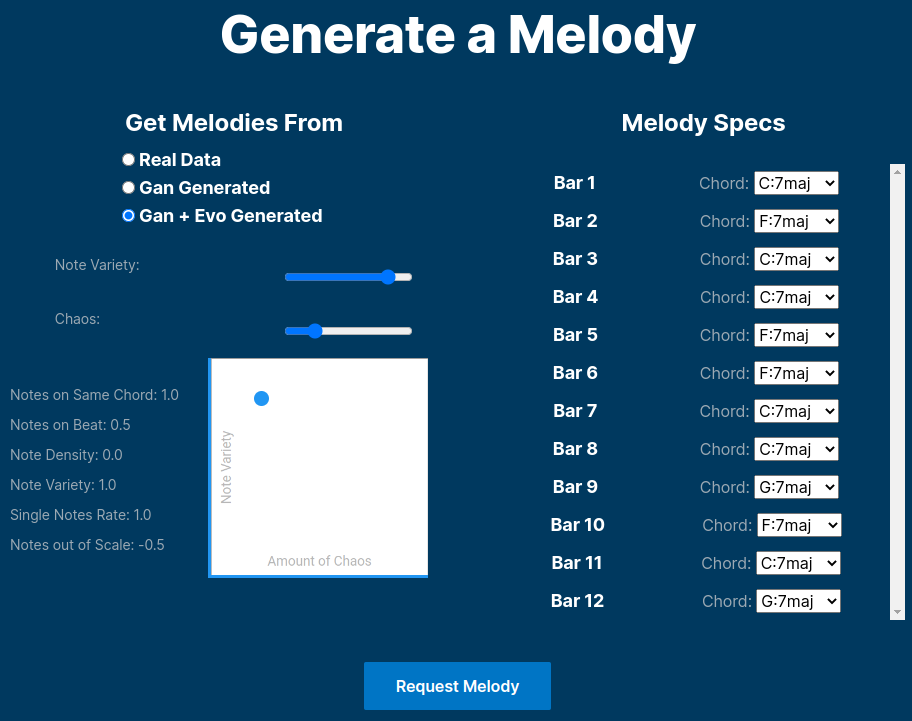

<!-- Improved compatibility of back to top link: See: https://github.com/othneildrew/Best-README-Template/pull/73 -->

<!--
*** Thanks for checking out the Best-README-Template. If you have a suggestion
*** that would make this better, please fork the repo and create a pull request
*** or simply open an issue with the tag "enhancement".
*** Don't forget to give the project a star!
*** Thanks again! Now go create something AMAZING! :D
-->

<!-- PROJECT SHIELDS -->
<!--
*** I'm using markdown "reference style" links for readability.
*** Reference links are enclosed in brackets [ ] instead of parentheses ( ).
*** See the bottom of this document for the declaration of the reference variables
*** for contributors-url, forks-url, etc. This is an optional, concise syntax you may use.
*** https://www.markdownguide.org/basic-syntax/#reference-style-links
-->

[![LinkedIn][linkedin-shield]][linkedin-url]

<!-- PROJECT LOGO -->
<br />
<div align="center">
  <a href="https://github.com/matheusbitaraes/AIHeroFront">
    
  </a>

  <h3 align="center">AI Hero Graphical User Interface</h3>

  <p align="center">
    An Artificial Intelligence built for generating musical melodies
    <br />
    <br/>
    <a href="https://github.com/matheusbitaraes/AIHeroFront">
        
    </a>
    <br />
    <br />
    <a href="https://aihero.bitaraes.com.br">View Demo</a>
    ·
    <a href="https://github.com/matheusbitaraes/aihero/issues">Report Bug</a>
    ·
    <a href="https://github.com/matheusbitaraes/aihero/issues">Request Feature</a>
  </p>
</div>

<!-- TABLE OF CONTENTS -->

<a name="readme-top"></a>

<details>
  <summary>Table of Contents</summary>
  <ol>
    <li>
      <a href="#about-the-project">About The Project</a>
    </li>
    <li>
      <a href="#getting-started">Getting Started</a>
      <ul>
        <li><a href="#installation">Installation</a></li>
        <li><a href="#execution">Execution</a></li>
      </ul>
    </li>
    <li><a href="#contact">Contact</a></li>
    <li><a href="#acknowledgments">Acknowledgments</a></li>
  </ol>
</details>

<!-- ABOUT THE PROJECT -->

## About The Project

The AI Hero project proposes a blues melody generator, that tries to emulate the improvisation process of the human mind.

![Project Architecture][project-architecure]

This work proposes an architecture composed
of a genetic algorithm whose initial population is fed by generative adversarial networks
(GANs) specialized in generating melodies for certain harmonic functions. The fitness
function of the genetic algorithm is a weighted sum of heuristic methods for evaluating
quality, where the weights of each function are assigned by the user, before requesting
the melody. A data augmentation statregy for the GAN training data was proposed and
experimentally validated. This experiment and two others are available in the [masters thesis](https://www.ppgee.ufmg.br/defesas/2006M.PDF) (in portuguese) generated by this work.

Also, [this article](https://www.sba.org.br/cba2022/wp-content/uploads/artigos_cba2022/paper_1817.pdf), validating a data augmentation strategy proposal, was published as a consequence of the work.

![Training Evidence][training-evidence]

<p align="right">(<a href="#readme-top">back to top</a>)</p>

<!-- ### Built With

This section should list any major frameworks/libraries used to bootstrap your project. Leave any add-ons/plugins for the acknowledgements section. Here are a few examples.

- [![React][react.js]][react-url]
- [![Vue][vue.js]][vue-url]
- [![Angular][angular.io]][angular-url]
- [![Svelte][svelte.dev]][svelte-url]
- [![Laravel][laravel.com]][laravel-url]
- [![Bootstrap][bootstrap.com]][bootstrap-url]
- [![Python][python.com]][python-url]

<p align="right">(<a href="#readme-top">back to top</a>)</p> -->

<!-- GETTING STARTED -->

## Getting Started

Below is the guideline on how to run the GUI locally.

### Installation

This project was developed using `React`. So, for executing it locally, you should just install the dependencies on client and server

```sh
cd client && npm install
```

```sh
cd server && npm install
```

<!-- _Below is an example of how you can instruct your audience on installing and setting up your app. This template doesn't rely on any external dependencies or services._

1. Get a free API Key at [https://example.com](https://example.com)
2. Clone the repo
   ```sh
   git clone https://github.com/your_username_/Project-Name.git
   ```
3. Install NPM packages
   ```sh
   npm install
   ```
4. Enter your API in `config.js`
   ```js
   const API_KEY = "ENTER YOUR API";
   ``` -->

<p align="right">(<a href="#readme-top">back to top</a>)</p>

<!-- USAGE EXAMPLES -->

### Execution

To run the GUI you should start the client.

```sh
cd client && npm start
```

If you also want to request melodies form the [AI Hero Server](https://github.com/matheusbitaraes/AIHero), you should also run the node server.

```sh
cd server && npm start
```

<!-- _For more examples, please refer to the [Documentation](https://example.com)_ -->

<p align="right">(<a href="#readme-top">back to top</a>)</p>

## Contact

For more clarification, please reach out!

Matheus Bitarães - [LinkedIn](https://linkedin.com/in/matheus-bitaraes) - matheusbitaraesdenovaes@gmail.com

Project Link: [https://aihero.bitaraes.com.br](https://aihero.bitaraes.com.br)

<p align="right">(<a href="#readme-top">back to top</a>)</p>

<!-- ACKNOWLEDGMENTS -->

## Acknowledgments

- Template created based on [this template](https://github.com/othneildrew/Best-README-Template/blob/master/README.md)

<p align="right">(<a href="#readme-top">back to top</a>)</p>

<!-- MARKDOWN LINKS & IMAGES -->
<!-- https://www.markdownguide.org/basic-syntax/#reference-style-links -->

[contributors-shield]: https://img.shields.io/github/contributors/othneildrew/Best-README-Template.svg?style=for-the-badge
[contributors-url]: https://github.com/othneildrew/Best-README-Template/graphs/contributors
[forks-shield]: https://img.shields.io/github/forks/othneildrew/Best-README-Template.svg?style=for-the-badge
[forks-url]: https://github.com/othneildrew/Best-README-Template/network/members
[stars-shield]: https://img.shields.io/github/stars/othneildrew/Best-README-Template.svg?style=for-the-badge
[stars-url]: https://github.com/othneildrew/Best-README-Template/stargazers
[issues-shield]: https://img.shields.io/github/issues/othneildrew/Best-README-Template.svg?style=for-the-badge
[issues-url]: https://github.com/othneildrew/Best-README-Template/issues
[license-shield]: https://img.shields.io/github/license/othneildrew/Best-README-Template.svg?style=for-the-badge
[license-url]: https://github.com/othneildrew/Best-README-Template/blob/master/LICENSE.txt
[linkedin-shield]: https://img.shields.io/badge/-LinkedIn-black.svg?style=for-the-badge&logo=linkedin&colorB=555
[linkedin-url]: https://linkedin.com/in/matheus-bitaraes
[product-screenshot]: documents/readme/GUI.png
[project-architecure]: documents/readme/architecture.png
[training-evidence]: documents/readme/gan_training.gif
[next.js]: https://img.shields.io/badge/next.js-000000?style=for-the-badge&logo=nextdotjs&logoColor=white
[next-url]: https://nextjs.org/
[react.js]: https://img.shields.io/badge/React-20232A?style=for-the-badge&logo=react&logoColor=61DAFB
[react-url]: https://reactjs.org/
[vue.js]: https://img.shields.io/badge/Vue.js-35495E?style=for-the-badge&logo=vuedotjs&logoColor=4FC08D
[vue-url]: https://vuejs.org/
[angular.io]: https://img.shields.io/badge/Angular-DD0031?style=for-the-badge&logo=angular&logoColor=white
[angular-url]: https://angular.io/
[svelte.dev]: https://img.shields.io/badge/Svelte-4A4A55?style=for-the-badge&logo=svelte&logoColor=FF3E00
[svelte-url]: https://svelte.dev/
[laravel.com]: https://img.shields.io/badge/Laravel-FF2D20?style=for-the-badge&logo=laravel&logoColor=white
